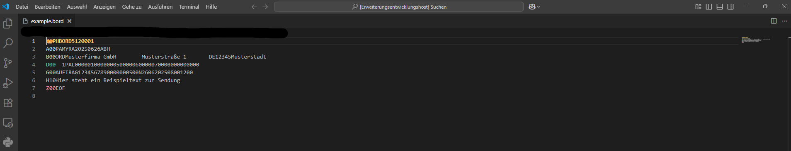

# FORTRAS 100 Syntax Highlighter

Ein leichtgewichtiges Visual Studio Code-Plugin zur farblichen Hervorhebung von FORTRAS 100 Datensätzen (Release 100).



---

## ✨ Features

- 💡 Automatische Erkennung anhand des Datei-Headers: `@@PHSTAT`, `@@PHBORD`, `@@PHENTL`
- 🎨 Farbliche Hervorhebung aller Satzarten: `A00`, `A10`, `B00`, `B10`, … bis `Z00`, inkl. `M00`, `N00`, `Q00`, `Q10`
- 🧠 Keine Einschränkung durch Dateiendung – funktioniert unabhängig von `.ftr`, `.bord`, `.txt`, `.dat`, etc.
- 📦 Optionales Farbschema „FORTRAS Theme“ (Dark) für optimierte visuelle Darstellung
- 🚀 Kompatibel mit allen FORTRAS 100 Formatvarianten (512 Zeichen/Satz)

- ## 🧩 Installation

1. [VSIX-Datei herunterladen](https://github.com/DennisR6/fortras-rainbow/tree/main/releases/Version%201.0.0)
2. Im Terminal:

```bash
code --install-extension fortras-syntax-1.0.0.vsix

