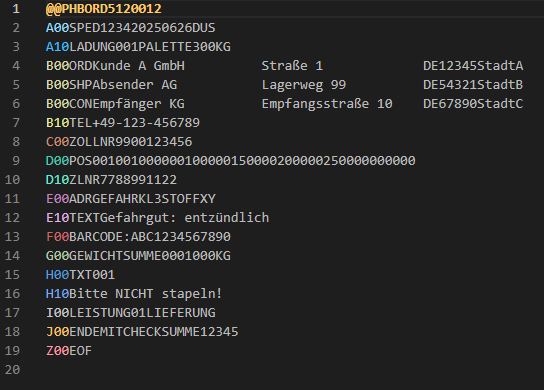

# FORTRAS 100 Syntax Highlighter

Ein leichtgewichtiges Visual Studio Code-Plugin zur farblichen Hervorhebung von FORTRAS 100 Datensätzen (Release 100), insbesondere im Format **BORD512**, **STAT512** und **ENTL512**.



---

## ✨ Features

- Unterstützung für Dateiendungen: `.ftr`, `.bord`, `.stat`, `.entl`
- Farben pro Satzart: A00, B00, C00 … Z00
- Erkennung des Dateikopfs (`@@PHBORD512`, `@@PHSTAT512`, etc.)
- Kompatibel mit allen FORTRAS 100 Datensatzformaten (512 Zeichen/Satz)
- Optional: mitgeliefertes Farbschema „FORTRAS Theme“ (Dark)

- ## 🧩 Installation

1. [VSIX-Datei herunterladen](https://github.com/DennisR6/fortras-rainbow/releases/Version 1.0.0)
2. Im Terminal:

```bash
code --install-extension fortras-syntax-1.0.0.vsix

